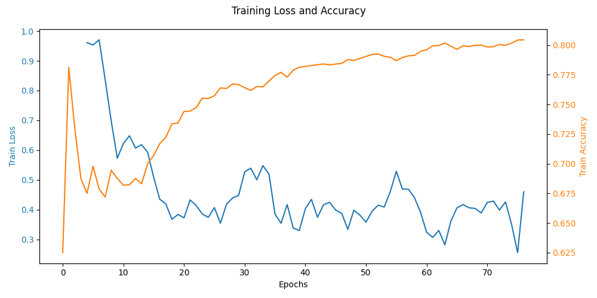

# Fall Detection using Dual-Projection Transformer

## Overview
This repository contains a PyTorch-based approach for classifying whether a person has fallen in a video sequence. The model utilizes a **Dual-Projection Transformer** architecture, combining embeddings from both image and floorplan representations. The method leverages Variational Autoencoders (VAEs) for feature extraction and a Transformer encoder for temporal modeling.

## Model Architecture
The model consists of three primary components:

1. **VAE-based Feature Extraction:**
   - Two separate VAEs (one for images and one for floorplans) are used to extract latent embeddings.
   - The VAEs are frozen during training to serve as fixed feature extractors.
   - The `VaeWrapper` class ensures compatibility between the VAEs and the transformer model.

2. **Projection Layers:**
   - The extracted latent features are projected into a common embedding space using linear layers.

3. **Dual-Projection Transformer:**
   - A Transformer encoder processes the combined embeddings to learn temporal dependencies.
   - The classification head predicts whether a fall has occurred in the given sequence.

## Forward Pass
1. The input consists of a sequence of **floorplan** and **image** tensors.
2. These inputs are reshaped and passed through their respective VAEs to obtain embeddings.
3. The embeddings are projected into a shared embedding space.
4. The projected embeddings are concatenated and passed through a Transformer encoder.
5. The first token of the Transformer output is used as a classification feature vector.
6. A final fully connected layer classifies the sequence into the respective category (fall or no fall).

## Training
- The VAEs are pre-trained separately before being integrated into the Transformer model.
- The Transformer and classification head are trained using standard classification loss functions, such as cross-entropy.

## Results
The following image shows the training progress of the model:

## Future Improvements
- Improve input data with random flips
- Label smoothing during training
- Improve preprocessing with better feature extraction
- Implement warm-up and decreasing learning rate during transformer training
- Fine-tuning VAEs jointly with the Transformer for end-to-end optimization.
- Experimenting with alternative transformer architectures, such as vision transformers (ViTs).
- Increase overall layer size and numbers
